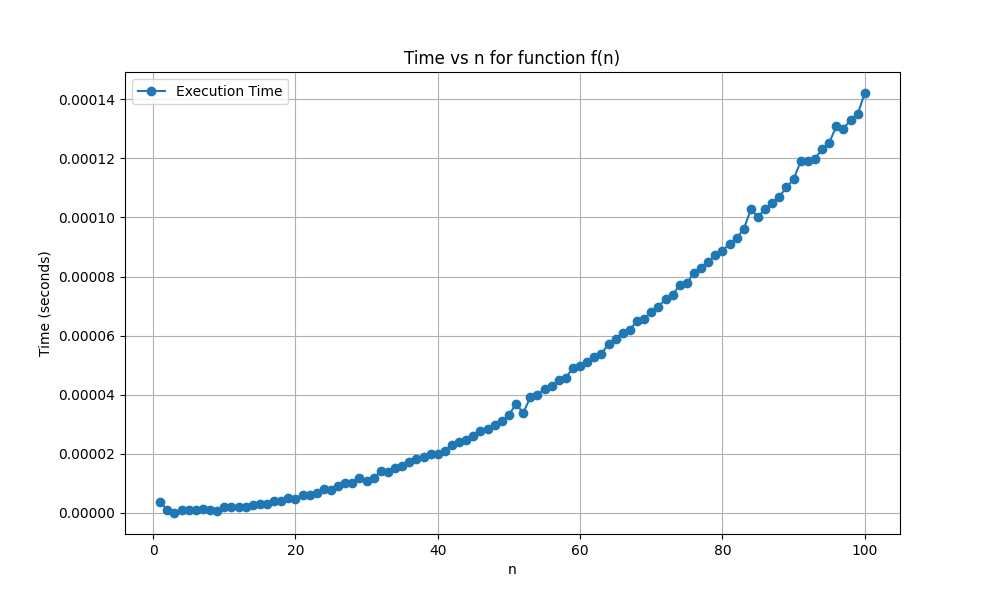
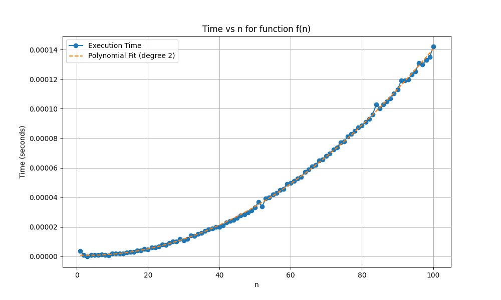
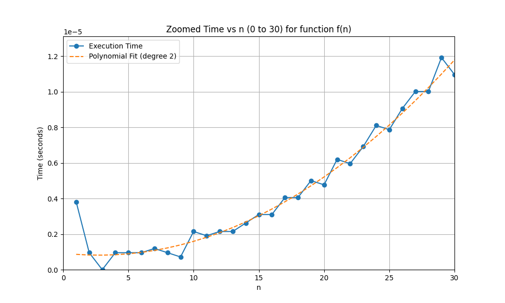

## 1. Runtime Analysis

The runtime of the function `f(n)` was analyzed mathematically and experimentally. A detailed solution is provided in !(solution.jpeg).

## 2. Timing and Plotting

The runtime of the function was measured for various values of `n` and plotted. The results are shown in .

## 3. Polynomial Fit

A polynomial curve was fitted to the timing data. This is illustrated in .

 - Big-O (Upper Bound):  Since the polynomial is quadratic, the upper bound is (O(n^2))
 - Big-Omega (Lower Bound): The lower bound will also be \(Ω(n^2)), as the execution time scales closely with \( n^2 \)
 - Big-Theta (Tight Bound): Therefore, the overall complexity is (Θ(n^2)), as the polynomial suggests quadratic growth.

## 4. Effect of Modification
 
 The plot to estimate the value of \( n_0 \) is shown in .

By zooming into the plot for values of \( n \) from 1 to 30, we can observe that the curve follows a polynomial growth pattern fairly closely for small values of \( n \). There isn't a clear deviation from the trend within this range, meaning \( n_0 \), where the time complexity changes or becomes significantly different from the polynomial fit, might be beyond this range.

From this zoomed plot, we can approximate \( n_0 \) to be around \( n = 1 \), corresponding to the point where the polynomial fit closely matches the actual timings. The curve remains consistent with the quadratic trend for larger values of \( n \).

## Function Modification and Its Impact on Performance

### Modified Function:

x = f(n)
   x = 1;
   y = 1;
   for i = 1:n
        for j = 1:n
             x = x + 1;
   y = i + j;

### Will this increase how long it takes the algorithm to run (e.g., you are timing the function like in #2)?

Yes, this will increase how long it takes the algorithm to run, but only slightly. The additional operation `y = i + j` adds extra work after the nested loops, but since it is done only after the loops finish, it does not affect the overall time complexity.

The nested loops still run \( n^2 \) times, and the new operation (`y = i + j`) is a single arithmetic operation that runs \( O(1) \) time outside the nested loops. Therefore, the overall time complexity remains \( O(n^2) \), and while it takes slightly longer in terms of absolute execution time, it doesn't change the big picture.

### 5. Will it affect your results from #1?

The execution time will increase slightly, but it won't significantly affect the results of the timing in #1. The relationship between `n` and the execution time will still follow a quadratic trend. This means that:

- **Polynomial fit**: The polynomial curve from the timing results might change slightly, but the overall shape of the graph will remain the same, reflecting \( O(n^2) \).
- **Timing differences**: The times will increase, but the increase will be negligible enough that the results and conclusions from question #1 remain valid.

## 6. Merge Sort Implementation

A TypeScript implementation of merge sort is provided in the [MergeSort](mergeSort.ts) file. The merge sort algorithm is tested on the array `[5, 2, 4, 7, 1, 3, 2, 6]`. You can find the implementation and test results within this file.

